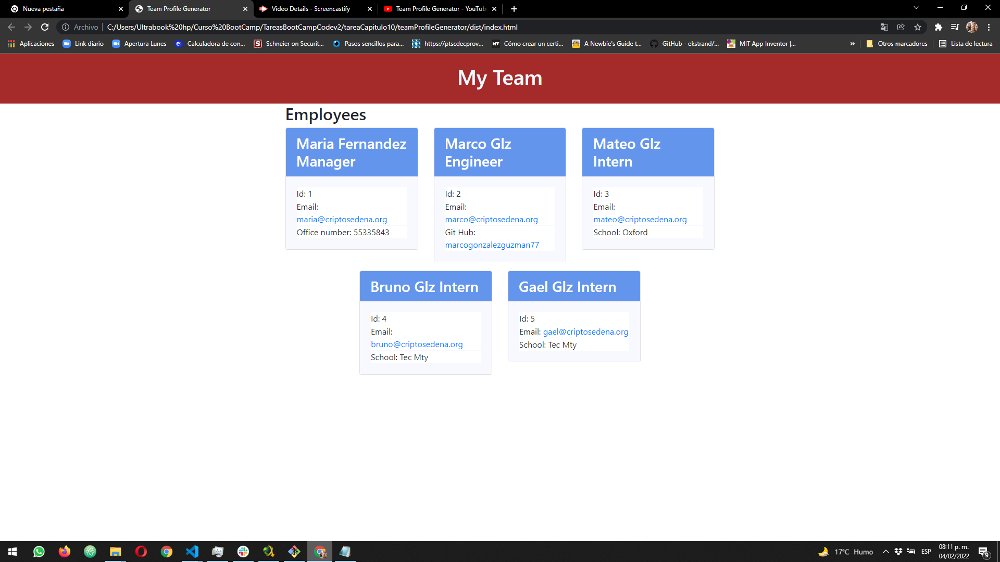

#  👓 Team Profile Generator

## 📄 Description

In this code we build a Node.js command-line application that takes in information about employees on a software engineering team, then generates an HTML webpage that displays summaries for each person. Testing is key to making code maintainable, so you’ll also write a unit test for every part of your code and ensure that it passes each test.

## ⚙⚙ Web Page Functionality

The following image shows the web page as a result of the command-line application team profile generator:

You can watch the test video [Team Profile Generator Video](https://www.youtube.com/watch?v=jPlWvkhGnf0).